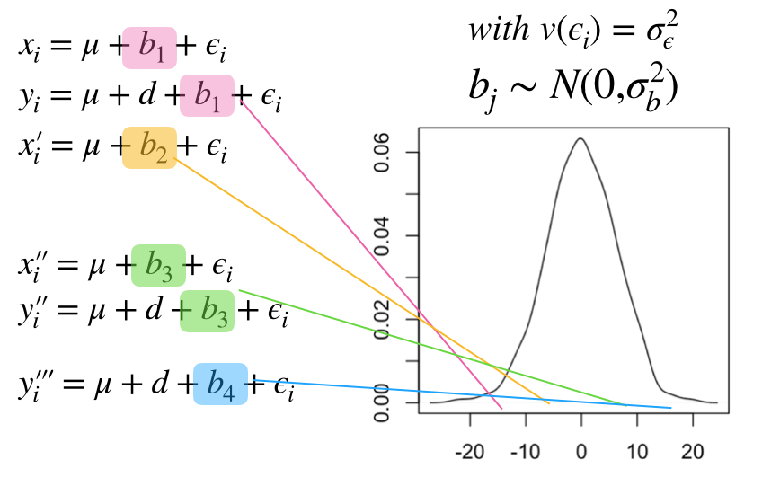

```{r setup, include=FALSE}
knitr::opts_chunk$set(echo = TRUE)

library(lme4)
library(ggplot2)
```

# Confounded design 

```{r}
mu = 0
d = 8
b = 4
```


1. $E(x_i) = \mu$
2. $E(y_i) = \mu + d$
3. $E(x_i') = \mu + b$

```{r}
set.seed(100)
x <- rnorm(25,mean = mu,sd = 1)
set.seed(100)
y <- rnorm(25,mean = mu + d,sd = 1.7)
set.seed(100)
x_1 <- rnorm(25,mean = mu + b,sd = 1.4)

value <- c(x,y,x_1)
x <- data.frame(value = value,
  Treatment = c(rep(c(0,1,0),times=c(25,25,25))),
                blocks = rep(c(1,2),times=c(50,25)))

ggplot(x,aes(x=factor(blocks),y=value,fill=factor(Treatment))) + geom_boxplot() 
```

## Block as a known fixed effect

```{r}
summary(lm(value ~ factor(Treatment) + factor(blocks),data=x))
```

* $\mu$

```{r}
mean(x$value[x$Treatment==0 & x$blocks == 1])
```

* *disease effect*

$d=\bar{y} - \bar{x}$

```{r}
mean(x$value[x$Treatment==1 & x$blocks == 1]) - mean(x$value[x$Treatment==0 & x$blocks == 1])
```

* *batch effect* $b=\bar{x}' - \bar{x}$


```{r}
mean(x$value[x$Treatment==0 & x$blocks == 2]) - mean(x$value[x$Treatment==0 & x$blocks == 1])
```

## What if we removed block 2?

```{r}
summary(lm(value ~ factor(Treatment),data=x[x$blocks == 1,]))
```

* The second batch does not provide any information in the estimate of the disease effect.
* Is it still worth putting it in?

## The estimate of the variance of the effect size depends on the residuals

* Estimate of the residual variance after fitting the model. 

${\sigma}^2 = \frac{sum(residuals^2)}{n - estimated \; betas}$

```{r}
mod1 <- lm(value ~ factor(Treatment) + factor(blocks),data=x)

sigma <- sum(mod1$residuals^2)/(nrow(x)-3)
x2 <- x
x2[,2] <- as.numeric(as.character(x2[,2]))
x2[,3] <- as.numeric(as.character(x2[,3]))
X <- as.matrix(cbind(1,x2[,2:3]))

unscaled_var <- solve(t(X) %*% X)

sqrt(unscaled_var*sigma)

summary(mod1)
```

* If we only use block 1

```{r}
mod1 <- lm(value ~ factor(Treatment),data=x[x$blocks == 1,])
sigma <- sum(mod1$residuals^2)/(nrow(x[x$blocks == 1,])-2)
x2 <- x[x$blocks == 1,]
x2[,2] <- as.numeric(as.character(x2[,2]))
X <- as.matrix(cbind(1,x2[,2]))

unscaled_var <- solve(t(X) %*% X)

sqrt(unscaled_var*sigma)

summary(mod1)
```

* Which is equivalent to estimating:

$V(disease \; effect) = V(mean \; in \; disease) -  V(mean \; in \; controls)$

$V(mean \; in \; disease) = \frac{{\sigma\; disease}^2}{n}$

```{r}
nc <- length(x$value[x$Treatment==0 & x$blocks == 0])
vc <- var(x$value[x$Treatment==0 & x$blocks == 0])/nc

nd <- length(x$value[x$Treatment==1 & x$blocks == 0])
vd <- var(x$value[x$Treatment==1 & x$blocks == 0])/nd

sqrt(vd + vc)
```

* What if we don't include *blocks*?

```{r}
mod1 <- lm(value ~ factor(Treatment),data=x)

summary(mod1)
```

## Block as random effect

```{r}
x$blocks <- factor(x$blocks)
fm1 <- lmer(value ~ factor(Treatment) + (1 | blocks), data = x)
summary(fm1)
```


# Compare fixed random models

* Only group one contains both treatments

```{r}
library(lme4)
library(ggplot2)
```

## Distribution of b_j at changing sigma2_b

```{r}
set.seed(100)
plot(density(rnorm(1000,mean = 0,sd = sqrt(4))),xlab="b_j",ylab="density",main="1k Random sampling from b_j distribution",xlim=c(-20,20))
lines(density(rnorm(1000,mean = 0,sd = sqrt(40))),col=2)
lines(density(rnorm(1000,mean = 0,sd = sqrt(400))),col=4)
legend("topleft",legend=c("sigma2_b = 4","sigma2_b = 40","sigma2_b = 400"),pch = rep(3,16),col=c(1,2,4))
```

## sigma2_b = sigma2_e

```{r}
mu <- 0 # mean in controls in batch1
d <- 8 # disease effect
sigma2_b <- 4 
sigma2_e <- 4
```

* Random $b_{js}$. The random intercepts below are quite close to each other, meaning that the batch effect will be quite small. The random effects could be increased by increasing $sigma_b$

```{r}
set.seed(100)
b <- rnorm(2,mean = 0,sd = sqrt(sigma2_b))

b[1]
b[2]
```

```{r}
set.seed(100)
x <- rnorm(25,mean = mu + b[1],sd = sqrt(sigma2_e))
set.seed(100)
y <- rnorm(25,mean = mu + d + b[1],sd = sqrt(sigma2_e))
set.seed(3546)
x_1 <- rnorm(25,mean = mu + b[2],sd = sqrt(sigma2_e))

value <- c(x,y,x_1)
datax <- data.frame(value = value,
  Treatment = c(rep(c(0,1,0),times=c(25,25,25))),
                blocks = rep(c(1,2),times=c(50,25)))

ggplot(datax,aes(x=factor(blocks),y=value,fill=factor(Treatment))) + geom_boxplot()
```

```{r}
datax$Treatment <- factor(datax$Treatment) 
datax$blocks <- factor(datax$blocks) 
table(datax$Treatment,datax$blocks)
```


```{r}
summary(lm(value ~ factor(Treatment) + factor(blocks),data=datax))
```

$\bar{y} - \bar{x}$

```{r}
mean(datax$value[datax$Treatment == 1 & datax$blocks == 1]) - mean(datax$value[datax$Treatment == 0 & datax$blocks == 1])
```


```{r}
datax$blocks <- factor(datax$blocks)
fm1 <- lmer(value ~ factor(Treatment) + (1 | blocks), data = datax)
summary(fm1)
```


## sigma2_b = 10*sigma2_e

```{r}
mu <- 0 # mean in controls in batch1
d <- 8 # disease effect
sigma2_e <- 4
sigma2_b <- 10*sigma2_e
```


```{r}
set.seed(100)
b <- rnorm(2,mean = 0,sd = sqrt(sigma2_b))

b[1]
b[2]
```

```{r}
set.seed(100)
x <- rnorm(25,mean = mu + b[1],sd = sqrt(sigma2_e))
set.seed(100)
y <- rnorm(25,mean = mu + d + b[1],sd = sqrt(sigma2_e))
set.seed(3546)
x_1 <- rnorm(25,mean = mu + b[2],sd = sqrt(sigma2_e))

value <- c(x,y,x_1)
datax <- data.frame(value = value,
  Treatment = c(rep(c(0,1,0),times=c(25,25,25))),
                blocks = rep(c(1,2),times=c(50,25)))

ggplot(datax,aes(x=factor(blocks),y=value,fill=factor(Treatment))) + geom_boxplot()
```

```{r}
datax$Treatment <- factor(datax$Treatment) 
datax$blocks <- factor(datax$blocks) 
table(datax$Treatment,datax$blocks)
```


```{r}
summary(lm(value ~ factor(Treatment) + factor(blocks),data=datax))
```


```{r}
datax$blocks <- factor(datax$blocks)
fm1 <- lmer(value ~ factor(Treatment) + (1 | blocks), data = datax)
summary(fm1)
```


## sigma2_b = 100*sigma2_e

```{r}
mu <- 0 # mean in controls in batch1
d <- 8 # disease effect
sigma2_e <- 4 
sigma2_b <- 100*sigma2_e
```

* Distribution of batch effects

```{r}
set.seed(100)
b <- rnorm(2,mean = 0,sd = sqrt(sigma2_b))

b[1]
b[2]
```

```{r}
set.seed(100)
x <- rnorm(25,mean = mu + b[1],sd = sqrt(sigma2_e))
set.seed(100)
y <- rnorm(25,mean = mu + d + b[1],sd = sqrt(sigma2_e))
set.seed(3546)
x_1 <- rnorm(25,mean = mu + b[2],sd = sqrt(sigma2_e))

value <- c(x,y,x_1)
datax <- data.frame(value = value,
  Treatment = c(rep(c(0,1,0),times=c(25,25,25))),
                blocks = rep(c(1,2),times=c(50,25)))

ggplot(datax,aes(x=factor(blocks),y=value,fill=factor(Treatment))) + geom_boxplot()
```

```{r}
datax$Treatment <- factor(datax$Treatment) 
datax$blocks <- factor(datax$blocks) 
table(datax$Treatment,datax$blocks)
```


```{r}
summary(lm(value ~ factor(Treatment) + factor(blocks),data=datax))
```


```{r}
datax$blocks <- factor(datax$blocks)
fm1 <- lmer(value ~ factor(Treatment) + (1 | blocks), data = datax)
summary(fm1)
```


## Comments

* In the examples above we increased $sigma^2_b$ to allow for higher variability between batches. It is interesting to observe that, as the variability between batches tends to infinity, the effect size estimated by the mixed model approaches the fixed effect estimate. 

* This case is very limited in how accurately we the $\sigma^2_b$ and $\sigma^2_e$ are estimated since we only have 2 observations (2 blocks) from which we have to estimate both of them. Both blocks contain both $\sigma^2_b + \sigma^2_e$. That's why they are so different in the REML estimate. There are still a lot of issues in the way these two components are estimated (Terry's is trying to figure out the algebra). This could be also a problem in the way the actual std.error estimates of the estimators are estimated and we might doubt a fixed effects model with only two blocks. 

* **But, does this problem becomes better if we have two blocks but across thousands of genes? The assumption done in Limma-Dupl correlations is that the $\rho$ is the same across genes. Does that increase the number that we use to make estimates?** - to be better understood maybe by 

* The use of fixed and random really depends on the context in which we are. Say, that in this case we only have two batches, that's all we got, then the fixed effect way is the closest approach that we can use. If we instead think that these two batches are two random observations out of a common distribution then the random effect is the design that you would think of. In the fixed effect we use one block as the baseline and we estimate the batch effect as a delta of difference in the other batches. However, with the random model we assign its own $b_j$ to every batch. 

# Simulate four batches




* Identifiability issue raised by Jinjin. The random variable from every batch will have the same sum of $\sigma^2_b + \sigma^2_{epsilon}$ and that's why their estimation does not happen in the usual way as in the OLS.  


## High disease effect and low between batches variability

```{r}
mu <- 0 # mean in controls in batch1
d <- 30 # disease effect
sigma2_e <- 2 
sigma2_b <- 2

set.seed(100)
b <- rnorm(5,mean = 0,sd = sqrt(sigma2_b))

b[1]
b[2]
b[3]
b[4]
b[5]
```


```{r}
set.seed(100)
x <- rnorm(25,mean = mu + b[1],sd = sqrt(sigma2_e))
set.seed(100)
y <- rnorm(25,mean = mu + d + b[1],sd = sqrt(sigma2_e))
set.seed(3546)
x_1 <- rnorm(25,mean = mu + b[2],sd = sqrt(sigma2_e))
set.seed(100)
x_2 <- rnorm(25,mean = mu + b[3],sd = sqrt(sigma2_e))
set.seed(100)
y_2 <- rnorm(25,mean = mu + d + b[3],sd = sqrt(sigma2_e))
set.seed(3546)
x_3 <- rnorm(25,mean = mu + b[4],sd = sqrt(sigma2_e))
set.seed(100)
y_3 <- rnorm(25,mean = mu + d + b[4],sd = sqrt(sigma2_e))
set.seed(100)
x_4 <- rnorm(25,mean = mu + b[5],sd = sqrt(sigma2_e))

value <- c(x,y,x_1,x_2,y_2,x_3,y_3,x_4)
datax <- data.frame(value = value,
  Treatment = c(rep(c(0,1,0,0,1,0,1,0),times=rep(25,8))),
                blocks = rep(c(1,2,3,4,5),times=c(50,25,50,50,25)))

ggplot(datax,aes(x=factor(blocks),y=value,fill=factor(Treatment))) + geom_boxplot()
```

```{r}
mod1 <- lm(value ~ factor(Treatment) + factor(blocks),data=datax)

summary(mod1)
```

## Block as random effect

```{r}
datax$blocks <- factor(datax$blocks)
fm1 <- lmer(value ~ factor(Treatment) + (1 | blocks), data = datax)
summary(fm1)
```


## High disease effect and high between batches variability

```{r}
mu <- 0 # mean in controls in batch1
d <- 30 # disease effect
sigma2_e <- 2 
sigma2_b <- 100*sigma2_e

set.seed(100)
b <- rnorm(5,mean = 0,sd = sqrt(sigma2_b))

b[1]
b[2]
b[3]
b[4]
b[5]
```


```{r}
set.seed(100)
x <- rnorm(25,mean = mu + b[1],sd = sqrt(sigma2_e))
set.seed(100)
y <- rnorm(25,mean = mu + d + b[1],sd = sqrt(sigma2_e))
set.seed(3546)
x_1 <- rnorm(25,mean = mu + b[2],sd = sqrt(sigma2_e))
set.seed(100)
x_2 <- rnorm(25,mean = mu + b[3],sd = sqrt(sigma2_e))
set.seed(100)
y_2 <- rnorm(25,mean = mu + d + b[3],sd = sqrt(sigma2_e))
set.seed(3546)
x_3 <- rnorm(25,mean = mu + b[4],sd = sqrt(sigma2_e))
set.seed(100)
y_3 <- rnorm(25,mean = mu + d + b[4],sd = sqrt(sigma2_e))
set.seed(100)
x_4 <- rnorm(25,mean = mu + b[5],sd = sqrt(sigma2_e))

value <- c(x,y,x_1,x_2,y_2,x_3,y_3,x_4)
datax <- data.frame(value = value,
  Treatment = c(rep(c(0,1,0,0,1,0,1,0),times=rep(25,8))),
                blocks = rep(c(1,2,3,4,5),times=c(50,25,50,50,25)))

ggplot(datax,aes(x=factor(blocks),y=value,fill=factor(Treatment))) + geom_boxplot()
```

```{r}
summary(lm(value ~ factor(Treatment) + factor(blocks),data=datax))
```

* Resisuals after using fixed effects


```{r}
fm1 <- lmer(value ~ factor(Treatment) + (1 | blocks), data = datax)
summary(fm1)
```


## Low disease effect and high between batches variability

```{r}
mu <- 0 # mean in controls in batch1
d <- 4 # disease effect
sigma2_e <- 2 
sigma2_b <- 100*sigma2_e

set.seed(100)
b <- rnorm(5,mean = 0,sd = sqrt(sigma2_b))

b[1]
b[2]
b[3]
b[4]
b[5]
```


```{r}
set.seed(100)
x <- rnorm(25,mean = mu + b[1],sd = sqrt(sigma2_e))
set.seed(100)
y <- rnorm(25,mean = mu + d + b[1],sd = sqrt(sigma2_e))
set.seed(3546)
x_1 <- rnorm(25,mean = mu + b[2],sd = sqrt(sigma2_e))
set.seed(100)
x_2 <- rnorm(25,mean = mu + b[3],sd = sqrt(sigma2_e))
set.seed(100)
y_2 <- rnorm(25,mean = mu + d + b[3],sd = sqrt(sigma2_e))
set.seed(3546)
x_3 <- rnorm(25,mean = mu + b[4],sd = sqrt(sigma2_e))
set.seed(100)
y_3 <- rnorm(25,mean = mu + d + b[4],sd = sqrt(sigma2_e))
set.seed(100)
x_4 <- rnorm(25,mean = mu + b[5],sd = sqrt(sigma2_e))

value <- c(x,y,x_1,x_2,y_2,x_3,y_3,x_4)
datax <- data.frame(value = value,
  Treatment = c(rep(c(0,1,0,0,1,0,1,0),times=rep(25,8))),
                blocks = rep(c(1,2,3,4,5),times=c(50,25,50,50,25)))

ggplot(datax,aes(x=factor(blocks),y=value,fill=factor(Treatment))) + geom_boxplot()
```

```{r}
summary(lm(value ~ factor(Treatment) + factor(blocks),data=datax))
```

```{r}
fm1 <- lmer(value ~ factor(Treatment) + (1 | blocks), data = datax)
summary(fm1)
```


## Low disease effect and low between batches variability

```{r}
mu <- 0 # mean in controls in batch1
d <- 4 # disease effect
sigma2_e <- 2 
sigma2_b <- sigma2_e

set.seed(100)
b <- rnorm(5,mean = 0,sd = sqrt(sigma2_b))

b[1]
b[2]
b[3]
b[4]
b[5]
```


```{r}
set.seed(100)
x <- rnorm(25,mean = mu + b[1],sd = sqrt(sigma2_e))
set.seed(100)
y <- rnorm(25,mean = mu + d + b[1],sd = sqrt(sigma2_e))
set.seed(3546)
x_1 <- rnorm(25,mean = mu + b[2],sd = sqrt(sigma2_e))
set.seed(100)
x_2 <- rnorm(25,mean = mu + b[3],sd = sqrt(sigma2_e))
set.seed(100)
y_2 <- rnorm(25,mean = mu + d + b[3],sd = sqrt(sigma2_e))
set.seed(3546)
x_3 <- rnorm(25,mean = mu + b[4],sd = sqrt(sigma2_e))
set.seed(100)
y_3 <- rnorm(25,mean = mu + d + b[4],sd = sqrt(sigma2_e))
set.seed(100)
x_4 <- rnorm(25,mean = mu + b[5],sd = sqrt(sigma2_e))

value <- c(x,y,x_1,x_2,y_2,x_3,y_3,x_4)
datax <- data.frame(value = value,
  Treatment = c(rep(c(0,1,0,0,1,0,1,0),times=rep(25,8))),
                blocks = rep(c(1,2,3,4,5),times=c(50,25,50,50,25)))

ggplot(datax,aes(x=factor(blocks),y=value,fill=factor(Treatment))) + geom_boxplot()
```

```{r}
summary(lm(value ~ factor(Treatment) + factor(blocks),data=datax))
```

```{r}
fm1 <- lmer(value ~ factor(Treatment) + (1 | blocks), data = datax)
summary(fm1)
```


## Comments

* As $\sigma^2_b$ goes to infinity the mixed model estimate of the effect of interest approaches the fixed effect model, and in particular $\bar{y} - \bar{x}$. 

* In cases when the variability between batches ( $\sigma^2_b$ ) is not that high with respect to the residual variability within bacthes ( $\sigma_{\epsilon}$ ) then the mixed effect models balances and adjusts better the batch effect and provide more precise estimates of the effect of interest. 