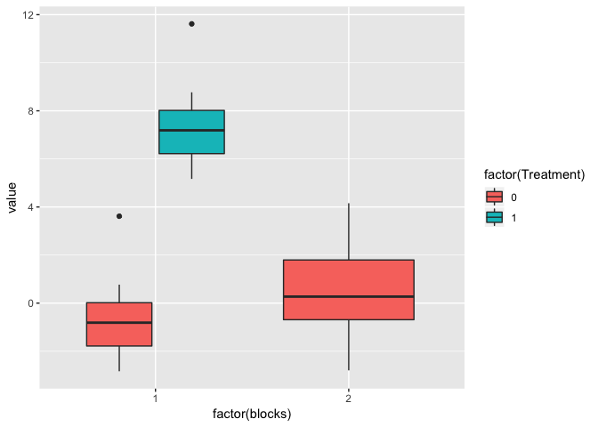

Fixed or random?
================
Anna Quaglieri
13/12/2017

-   [Confounded design](#confounded-design)
    -   [Block as a known fixed effect](#block-as-a-known-fixed-effect)
    -   [What if we removed block 2?](#what-if-we-removed-block-2)
    -   [The estimate of the variance of the effect size depends on the residuals](#the-estimate-of-the-variance-of-the-effect-size-depends-on-the-residuals)
    -   [Block as random effect](#block-as-random-effect)
-   [Compare fixed random models](#compare-fixed-random-models)
    -   [Distribution of b\_j at changing sigma2\_b](#distribution-of-b_j-at-changing-sigma2_b)
    -   [sigma2\_b = sigma2\_e](#sigma2_b-sigma2_e)
    -   [sigma2\_b = 10\*sigma2\_e](#sigma2_b-10sigma2_e)
    -   [sigma2\_b = 100\*sigma2\_e](#sigma2_b-100sigma2_e)
    -   [Comments](#comments)
-   [Simulate four batches](#simulate-four-batches)
    -   [High disease effect and low between batches variability](#high-disease-effect-and-low-between-batches-variability)
    -   [High disease effect and high between batches variability](#high-disease-effect-and-high-between-batches-variability)
    -   [Low disease effect and high between batches variability](#low-disease-effect-and-high-between-batches-variability)
    -   [Low disease effect and low between batches variability](#low-disease-effect-and-low-between-batches-variability)

Confounded design
=================

``` r
mu = 0
d = 8
b = 4
```

1.  *E*(*x*<sub>*i*</sub>)=*μ*
2.  *E*(*y*<sub>*i*</sub>)=*μ* + *d*
3.  *E*(*x*<sub>*i*</sub>′) = *μ* + *b*

``` r
set.seed(100)
x <- rnorm(25,mean = mu,sd = 1)
set.seed(100)
y <- rnorm(25,mean = mu + d,sd = 1)
set.seed(100)
x_1 <- rnorm(25,mean = mu + b,sd = 1)

value <- c(x,y,x_1)
x <- data.frame(value = value,
  Treatment = c(rep(c(0,1,0),times=c(25,25,25))),
                blocks = rep(c(1,2),times=c(50,25)))

ggplot(x,aes(x=factor(blocks),y=value,fill=factor(Treatment))) + geom_boxplot() 
```


Block as a known fixed effect
-----------------------------

``` r
summary(lm(value ~ factor(Treatment) + factor(blocks),data=x))
```

    ## 
    ## Call:
    ## lm(formula = value ~ factor(Treatment) + factor(blocks), data = x)
    ## 
    ## Residuals:
    ##     Min      1Q  Median      3Q     Max 
    ## -1.0220 -0.4970 -0.0119  0.4027  2.2021 
    ## 
    ## Coefficients:
    ##                    Estimate Std. Error t value Pr(>|t|)    
    ## (Intercept)          0.1082     0.1406    0.77    0.444    
    ## factor(Treatment)1   8.0000     0.1988   40.24   <2e-16 ***
    ## factor(blocks)2      4.0000     0.1988   20.12   <2e-16 ***
    ## ---
    ## Signif. codes:  0 '***' 0.001 '**' 0.01 '*' 0.05 '.' 0.1 ' ' 1
    ## 
    ## Residual standard error: 0.7029 on 72 degrees of freedom
    ## Multiple R-squared:  0.9574, Adjusted R-squared:  0.9562 
    ## F-statistic: 809.7 on 2 and 72 DF,  p-value: < 2.2e-16

-   *μ*

``` r
mean(x$value[x$Treatment==0 & x$blocks == 1])
```

    ## [1] 0.108172

-   *disease effect*

$d=\\bar{y} - \\bar{x}$

``` r
mean(x$value[x$Treatment==1 & x$blocks == 1]) - mean(x$value[x$Treatment==0 & x$blocks == 1])
```

    ## [1] 8

-   *batch effect*

$b=\\bar{x}' - \\bar{x}$

``` r
mean(x$value[x$Treatment==0 & x$blocks == 2]) - mean(x$value[x$Treatment==0 & x$blocks == 1])
```

    ## [1] 4

What if we removed block 2?
---------------------------

``` r
summary(lm(value ~ factor(Treatment),data=x[x$blocks == 1,]))
```

    ## 
    ## Call:
    ## lm(formula = value ~ factor(Treatment), data = x[x$blocks == 
    ##     1, ])
    ## 
    ## Residuals:
    ##     Min      1Q  Median      3Q     Max 
    ## -1.0220 -0.4970 -0.0119  0.4027  2.2021 
    ## 
    ## Coefficients:
    ##                    Estimate Std. Error t value Pr(>|t|)    
    ## (Intercept)          0.1082     0.1406    0.77    0.445    
    ## factor(Treatment)1   8.0000     0.1988   40.24   <2e-16 ***
    ## ---
    ## Signif. codes:  0 '***' 0.001 '**' 0.01 '*' 0.05 '.' 0.1 ' ' 1
    ## 
    ## Residual standard error: 0.7029 on 48 degrees of freedom
    ## Multiple R-squared:  0.9712, Adjusted R-squared:  0.9706 
    ## F-statistic:  1619 on 1 and 48 DF,  p-value: < 2.2e-16

-   The second batch does not provide any information in the estimate of the disease effect.
-   Is it still worth putting it in?

The estimate of the variance of the effect size depends on the residuals
------------------------------------------------------------------------

-   Estimate of the residual variance after fitting the model.

${\\sigma}^2 = \\frac{sum(residuals^2)}{n - estimated \\; betas}$

``` r
mod1 <- lm(value ~ factor(Treatment) + factor(blocks),data=x)

sigma <- sum(mod1$residuals^2)/(nrow(x)-3)
x2 <- x
x2[,2] <- as.numeric(as.character(x2[,2]))
x2[,3] <- as.numeric(as.character(x2[,3]))
X <- as.matrix(cbind(1,x2[,2:3]))

unscaled_var <- solve(t(X) %*% X)

sqrt(unscaled_var*sigma)
```

    ## Warning in sqrt(unscaled_var * sigma): NaNs produced

    ##                   1 Treatment    blocks
    ## 1         0.3143279       NaN       NaN
    ## Treatment       NaN 0.1987984 0.1405717
    ## blocks          NaN 0.1405717 0.1987984

``` r
summary(mod1)
```

    ## 
    ## Call:
    ## lm(formula = value ~ factor(Treatment) + factor(blocks), data = x)
    ## 
    ## Residuals:
    ##     Min      1Q  Median      3Q     Max 
    ## -1.0220 -0.4970 -0.0119  0.4027  2.2021 
    ## 
    ## Coefficients:
    ##                    Estimate Std. Error t value Pr(>|t|)    
    ## (Intercept)          0.1082     0.1406    0.77    0.444    
    ## factor(Treatment)1   8.0000     0.1988   40.24   <2e-16 ***
    ## factor(blocks)2      4.0000     0.1988   20.12   <2e-16 ***
    ## ---
    ## Signif. codes:  0 '***' 0.001 '**' 0.01 '*' 0.05 '.' 0.1 ' ' 1
    ## 
    ## Residual standard error: 0.7029 on 72 degrees of freedom
    ## Multiple R-squared:  0.9574, Adjusted R-squared:  0.9562 
    ## F-statistic: 809.7 on 2 and 72 DF,  p-value: < 2.2e-16

-   If we only use block 1

``` r
mod1 <- lm(value ~ factor(Treatment),data=x[x$blocks == 1,])
sigma <- sum(mod1$residuals^2)/(nrow(x[x$blocks == 0,])-2)
x2 <- x[x$blocks == 0,]
x2[,2] <- as.numeric(as.character(x2[,2]))
X <- as.matrix(cbind(1,x2[,2]))

unscaled_var <- solve(t(X) %*% X)

sqrt(unscaled_var*sigma)
```

    ## Warning in sqrt(unscaled_var * sigma): NaNs produced

    ##      [,1]
    ## [1,]  NaN

``` r
summary(mod1)
```

    ## 
    ## Call:
    ## lm(formula = value ~ factor(Treatment), data = x[x$blocks == 
    ##     1, ])
    ## 
    ## Residuals:
    ##     Min      1Q  Median      3Q     Max 
    ## -1.0220 -0.4970 -0.0119  0.4027  2.2021 
    ## 
    ## Coefficients:
    ##                    Estimate Std. Error t value Pr(>|t|)    
    ## (Intercept)          0.1082     0.1406    0.77    0.445    
    ## factor(Treatment)1   8.0000     0.1988   40.24   <2e-16 ***
    ## ---
    ## Signif. codes:  0 '***' 0.001 '**' 0.01 '*' 0.05 '.' 0.1 ' ' 1
    ## 
    ## Residual standard error: 0.7029 on 48 degrees of freedom
    ## Multiple R-squared:  0.9712, Adjusted R-squared:  0.9706 
    ## F-statistic:  1619 on 1 and 48 DF,  p-value: < 2.2e-16

-   Which is equivalent to estimating:

*V*(*d**i**s**e**a**s**e* *e**f**f**e**c**t*)=*V*(*m**e**a**n* *i**n* *d**i**s**e**a**s**e*)−*V*(*m**e**a**n* *i**n* *c**o**n**t**r**o**l**s*)

$V(mean \\; in \\; disease) = \\frac{{\\sigma\\; disease}^2}{n}$

``` r
nc <- length(x$value[x$Treatment==0 & x$blocks == 0])
vc <- var(x$value[x$Treatment==0 & x$blocks == 0])/nc

nd <- length(x$value[x$Treatment==1 & x$blocks == 0])
vd <- var(x$value[x$Treatment==1 & x$blocks == 0])/nd

sqrt(vd + vc)
```

    ## [1] NA

-   What if we don't include *blocks*?

``` r
mod1 <- lm(value ~ factor(Treatment),data=x)

summary(mod1)
```

    ## 
    ## Call:
    ## lm(formula = value ~ factor(Treatment), data = x)
    ## 
    ## Residuals:
    ##     Min      1Q  Median      3Q     Max 
    ## -3.0220 -1.4955  0.0088  1.5175  4.2021 
    ## 
    ## Coefficients:
    ##                    Estimate Std. Error t value Pr(>|t|)    
    ## (Intercept)           2.108      0.254   8.298 3.87e-12 ***
    ## factor(Treatment)1    6.000      0.440  13.636  < 2e-16 ***
    ## ---
    ## Signif. codes:  0 '***' 0.001 '**' 0.01 '*' 0.05 '.' 0.1 ' ' 1
    ## 
    ## Residual standard error: 1.796 on 73 degrees of freedom
    ## Multiple R-squared:  0.7181, Adjusted R-squared:  0.7142 
    ## F-statistic: 185.9 on 1 and 73 DF,  p-value: < 2.2e-16

Block as random effect
----------------------

``` r
x$blocks <- factor(x$blocks)
fm1 <- lmer(value ~ factor(Treatment) + (1 | blocks), data = x)
summary(fm1)
```

    ## Linear mixed model fit by REML ['lmerMod']
    ## Formula: value ~ factor(Treatment) + (1 | blocks)
    ##    Data: x
    ## 
    ## REML criterion at convergence: 168.8
    ## 
    ## Scaled residuals: 
    ##      Min       1Q   Median       3Q      Max 
    ## -1.46107 -0.71066 -0.01693  0.57644  3.14013 
    ## 
    ## Random effects:
    ##  Groups   Name        Variance Std.Dev.
    ##  blocks   (Intercept) 7.980    2.8249  
    ##  Residual             0.494    0.7029  
    ## Number of obs: 75, groups:  blocks, 2
    ## 
    ## Fixed effects:
    ##                    Estimate Std. Error t value
    ## (Intercept)          2.1082     2.0000   1.054
    ## factor(Treatment)1   7.9951     0.1987  40.229
    ## 
    ## Correlation of Fixed Effects:
    ##             (Intr)
    ## fctr(Trtm)1 -0.025

Compare fixed random models
===========================

-   Only group one contains both treatments

``` r
library(lme4)
library(ggplot2)
```

Distribution of b\_j at changing sigma2\_b
------------------------------------------

``` r
set.seed(100)
plot(density(rnorm(1000,mean = 0,sd = sqrt(4))),xlab="b_j",ylab="density",main="1k Random sampling from b_j distribution",xlim=c(-20,20))
lines(density(rnorm(1000,mean = 0,sd = sqrt(40))),col=2)
lines(density(rnorm(1000,mean = 0,sd = sqrt(400))),col=4)
```


sigma2\_b = sigma2\_e
---------------------

``` r
mu <- 0 # mean in controls in batch1
d <- 8 # disease effect
sigma2_b <- 4 
sigma2_e <- 4
```

-   Random *b*<sub>*j**s*</sub>. The random intercepts below are quite close to each other, meaning that the batch effect might not be that small. The random effects could be increases by increasing *s**i**g**m**a*<sub>*b*</sub>

``` r
set.seed(100)
b <- rnorm(2,mean = 0,sd = sqrt(sigma2_b))

b[1]
```

    ## [1] -1.004385

``` r
b[2]
```

    ## [1] 0.2630623

``` r
set.seed(100)
x <- rnorm(25,mean = mu + b[1],sd = sqrt(sigma2_e))
set.seed(100)
y <- rnorm(25,mean = mu + d + b[1],sd = sqrt(sigma2_e))
set.seed(3546)
x_1 <- rnorm(25,mean = mu + b[2],sd = sqrt(sigma2_e))

value <- c(x,y,x_1)
datax <- data.frame(value = value,
  Treatment = c(rep(c(0,1,0),times=c(25,25,25))),
                blocks = rep(c(1,2),times=c(50,25)))

ggplot(datax,aes(x=factor(blocks),y=value,fill=factor(Treatment))) + geom_boxplot()
```



``` r
datax$Treatment <- factor(datax$Treatment) 
datax$blocks <- factor(datax$blocks) 
table(datax$Treatment,datax$blocks)
```

    ##    
    ##      1  2
    ##   0 25 25
    ##   1 25  0

``` r
summary(lm(value ~ Treatment + blocks,data=datax))
```

    ## 
    ## Call:
    ## lm(formula = value ~ Treatment + blocks, data = datax)
    ## 
    ## Residuals:
    ##     Min      1Q  Median      3Q     Max 
    ## -3.3889 -1.0925 -0.0366  1.1621  4.4042 
    ## 
    ## Coefficients:
    ##             Estimate Std. Error t value Pr(>|t|)    
    ## (Intercept)  -0.7880     0.3120  -2.526  0.01373 *  
    ## Treatment1    8.0000     0.4412  18.133  < 2e-16 ***
    ## blocks2       1.3820     0.4412   3.133  0.00251 ** 
    ## ---
    ## Signif. codes:  0 '***' 0.001 '**' 0.01 '*' 0.05 '.' 0.1 ' ' 1
    ## 
    ## Residual standard error: 1.56 on 72 degrees of freedom
    ## Multiple R-squared:  0.8392, Adjusted R-squared:  0.8347 
    ## F-statistic: 187.9 on 2 and 72 DF,  p-value: < 2.2e-16

$\\bar{y} - \\bar{x}$

``` r
mean(datax$value[datax$Treatment == 1 & datax$blocks == 1]) - mean(datax$value[datax$Treatment == 0 & datax$blocks == 1])
```

    ## [1] 8

``` r
datax$blocks <- factor(datax$blocks)
fm1 <- lmer(value ~ factor(Treatment) + (1 | blocks), data = datax)
summary(fm1)
```

    ## Linear mixed model fit by REML ['lmerMod']
    ## Formula: value ~ factor(Treatment) + (1 | blocks)
    ##    Data: datax
    ## 
    ## REML criterion at convergence: 281.5
    ## 
    ## Scaled residuals: 
    ##      Min       1Q   Median       3Q      Max 
    ## -2.12751 -0.69515 -0.03386  0.74856  2.82362 
    ## 
    ## Random effects:
    ##  Groups   Name        Variance Std.Dev.
    ##  blocks   (Intercept) 0.8577   0.9261  
    ##  Residual             2.4329   1.5598  
    ## Number of obs: 75, groups:  blocks, 2
    ## 
    ## Fixed effects:
    ##                    Estimate Std. Error t value
    ## (Intercept)        -0.09702    0.69102   -0.14
    ## factor(Treatment)1  7.92958    0.43552   18.21
    ## 
    ## Correlation of Fixed Effects:
    ##             (Intr)
    ## fctr(Trtm)1 -0.162

sigma2\_b = 10\*sigma2\_e
-------------------------

``` r
mu <- 0 # mean in controls in batch1
d <- 8 # disease effect
sigma2_e <- 4
sigma2_b <- 10*sigma2_e
```

``` r
set.seed(100)
b <- rnorm(2,mean = 0,sd = sqrt(sigma2_b))

b[1]
```

    ## [1] -3.176143

``` r
b[2]
```

    ## [1] 0.8318761

``` r
set.seed(100)
x <- rnorm(25,mean = mu + b[1],sd = sqrt(sigma2_e))
set.seed(100)
y <- rnorm(25,mean = mu + d + b[1],sd = sqrt(sigma2_e))
set.seed(3546)
x_1 <- rnorm(25,mean = mu + b[2],sd = sqrt(sigma2_e))

value <- c(x,y,x_1)
datax <- data.frame(value = value,
  Treatment = c(rep(c(0,1,0),times=c(25,25,25))),
                blocks = rep(c(1,2),times=c(50,25)))

ggplot(datax,aes(x=factor(blocks),y=value,fill=factor(Treatment))) + geom_boxplot()
```


``` r
datax$Treatment <- factor(datax$Treatment) 
datax$blocks <- factor(datax$blocks) 
table(datax$Treatment,datax$blocks)
```

    ##    
    ##      1  2
    ##   0 25 25
    ##   1 25  0

``` r
summary(lm(value ~ Treatment + blocks,data=datax))
```

    ## 
    ## Call:
    ## lm(formula = value ~ Treatment + blocks, data = datax)
    ## 
    ## Residuals:
    ##     Min      1Q  Median      3Q     Max 
    ## -3.3889 -1.0925 -0.0366  1.1621  4.4042 
    ## 
    ## Coefficients:
    ##             Estimate Std. Error t value Pr(>|t|)    
    ## (Intercept)  -2.9598     0.3120  -9.488 2.60e-14 ***
    ## Treatment1    8.0000     0.4412  18.133  < 2e-16 ***
    ## blocks2       4.1226     0.4412   9.345 4.78e-14 ***
    ## ---
    ## Signif. codes:  0 '***' 0.001 '**' 0.01 '*' 0.05 '.' 0.1 ' ' 1
    ## 
    ## Residual standard error: 1.56 on 72 degrees of freedom
    ## Multiple R-squared:  0.8204, Adjusted R-squared:  0.8154 
    ## F-statistic: 164.5 on 2 and 72 DF,  p-value: < 2.2e-16

``` r
datax$blocks <- factor(datax$blocks)
fm1 <- lmer(value ~ factor(Treatment) + (1 | blocks), data = datax)
summary(fm1)
```

    ## Linear mixed model fit by REML ['lmerMod']
    ## Formula: value ~ factor(Treatment) + (1 | blocks)
    ##    Data: datax
    ## 
    ## REML criterion at convergence: 283.7
    ## 
    ## Scaled residuals: 
    ##      Min       1Q   Median       3Q      Max 
    ## -2.15752 -0.70800 -0.03821  0.74856  2.82362 
    ## 
    ## Random effects:
    ##  Groups   Name        Variance Std.Dev.
    ##  blocks   (Intercept) 8.401    2.898   
    ##  Residual             2.433    1.560   
    ## Number of obs: 75, groups:  blocks, 2
    ## 
    ## Fixed effects:
    ##                    Estimate Std. Error t value
    ## (Intercept)         -0.8985     2.0613  -0.436
    ## factor(Treatment)1   7.9764     0.4405  18.106
    ## 
    ## Correlation of Fixed Effects:
    ##             (Intr)
    ## fctr(Trtm)1 -0.054

sigma2\_b = 100\*sigma2\_e
--------------------------

``` r
mu <- 0 # mean in controls in batch1
d <- 8 # disease effect
sigma2_e <- 4 
sigma2_b <- 100*sigma2_e
```

-   Distribution of batch effects

``` r
set.seed(100)
b <- rnorm(2,mean = 0,sd = sqrt(sigma2_b))

b[1]
```

    ## [1] -10.04385

``` r
b[2]
```

    ## [1] 2.630623

``` r
set.seed(100)
x <- rnorm(25,mean = mu + b[1],sd = sqrt(sigma2_e))
set.seed(100)
y <- rnorm(25,mean = mu + d + b[1],sd = sqrt(sigma2_e))
set.seed(3546)
x_1 <- rnorm(25,mean = mu + b[2],sd = sqrt(sigma2_e))

value <- c(x,y,x_1)
datax <- data.frame(value = value,
  Treatment = c(rep(c(0,1,0),times=c(25,25,25))),
                blocks = rep(c(1,2),times=c(50,25)))

ggplot(datax,aes(x=factor(blocks),y=value,fill=factor(Treatment))) + geom_boxplot()
```


``` r
datax$Treatment <- factor(datax$Treatment) 
datax$blocks <- factor(datax$blocks) 
table(datax$Treatment,datax$blocks)
```

    ##    
    ##      1  2
    ##   0 25 25
    ##   1 25  0

``` r
summary(lm(value ~ Treatment + blocks,data=datax))
```

    ## 
    ## Call:
    ## lm(formula = value ~ Treatment + blocks, data = datax)
    ## 
    ## Residuals:
    ##     Min      1Q  Median      3Q     Max 
    ## -3.3889 -1.0925 -0.0366  1.1621  4.4042 
    ## 
    ## Coefficients:
    ##             Estimate Std. Error t value Pr(>|t|)    
    ## (Intercept)  -9.8275     0.3120  -31.50   <2e-16 ***
    ## Treatment1    8.0000     0.4412   18.13   <2e-16 ***
    ## blocks2      12.7891     0.4412   28.99   <2e-16 ***
    ## ---
    ## Signif. codes:  0 '***' 0.001 '**' 0.01 '*' 0.05 '.' 0.1 ' ' 1
    ## 
    ## Residual standard error: 1.56 on 72 degrees of freedom
    ## Multiple R-squared:  0.9226, Adjusted R-squared:  0.9204 
    ## F-statistic:   429 on 2 and 72 DF,  p-value: < 2.2e-16

``` r
datax$blocks <- factor(datax$blocks)
fm1 <- lmer(value ~ factor(Treatment) + (1 | blocks), data = datax)
summary(fm1)
```

    ## Linear mixed model fit by REML ['lmerMod']
    ## Formula: value ~ factor(Treatment) + (1 | blocks)
    ##    Data: datax
    ## 
    ## REML criterion at convergence: 285.9
    ## 
    ## Scaled residuals: 
    ##      Min       1Q   Median       3Q      Max 
    ## -2.16778 -0.70287 -0.02833  0.74856  2.82362 
    ## 
    ## Random effects:
    ##  Groups   Name        Variance Std.Dev.
    ##  blocks   (Intercept) 81.680   9.038   
    ##  Residual              2.433   1.560   
    ## Number of obs: 75, groups:  blocks, 2
    ## 
    ## Fixed effects:
    ##                    Estimate Std. Error t value
    ## (Intercept)         -3.4330     6.3944  -0.537
    ## factor(Treatment)1   7.9924     0.4411  18.119
    ## 
    ## Correlation of Fixed Effects:
    ##             (Intr)
    ## fctr(Trtm)1 -0.017

Comments
--------

-   In the examples above we increased *s**i**g**m**a*<sub>*b*</sub><sup>2</sup> to allow for higher variability between batches. It is interesting to observe that, as the variability between batches tends to infinity, the effect size estimated by the mixed model approaches the fixed effect estimate.

-   One intuitive way to think about it

Simulate four batches
=====================

High disease effect and low between batches variability
-------------------------------------------------------

``` r
mu <- 0 # mean in controls in batch1
d <- 30 # disease effect
sigma2_e <- 2 
sigma2_b <- 2

set.seed(100)
b <- rnorm(5,mean = 0,sd = sqrt(sigma2_b))

b[1]
```

    ## [1] -0.7102072

``` r
b[2]
```

    ## [1] 0.1860132

``` r
b[3]
```

    ## [1] -0.1116056

``` r
b[4]
```

    ## [1] 1.254103

``` r
b[5]
```

    ## [1] 0.1654224

``` r
set.seed(100)
x <- rnorm(25,mean = mu + b[1],sd = sqrt(sigma2_e))
set.seed(100)
y <- rnorm(25,mean = mu + d + b[1],sd = sqrt(sigma2_e))
set.seed(3546)
x_1 <- rnorm(25,mean = mu + b[2],sd = sqrt(sigma2_e))
set.seed(100)
x_2 <- rnorm(25,mean = mu + b[3],sd = sqrt(sigma2_e))
set.seed(100)
y_2 <- rnorm(25,mean = mu + d + b[3],sd = sqrt(sigma2_e))
set.seed(3546)
x_3 <- rnorm(25,mean = mu + b[4],sd = sqrt(sigma2_e))
set.seed(100)
y_3 <- rnorm(25,mean = mu + d + b[4],sd = sqrt(sigma2_e))
set.seed(100)
x_4 <- rnorm(25,mean = mu + b[5],sd = sqrt(sigma2_e))

value <- c(x,y,x_1,x_2,y_2,x_3,y_3,x_4)
datax <- data.frame(value = value,
  Treatment = c(rep(c(0,1,0,0,1,0,1,0),times=rep(25,8))),
                blocks = rep(c(1,2,3,4,5),times=c(50,25,50,50,25)))

ggplot(datax,aes(x=factor(blocks),y=value,fill=factor(Treatment))) + geom_boxplot()
```


High disease effect and high between batches variability
--------------------------------------------------------

``` r
mu <- 0 # mean in controls in batch1
d <- 30 # disease effect
sigma2_e <- 2 
sigma2_b <- 100*sigma2_e

set.seed(100)
b <- rnorm(5,mean = 0,sd = sqrt(sigma2_b))

b[1]
```

    ## [1] -7.102072

``` r
b[2]
```

    ## [1] 1.860132

``` r
b[3]
```

    ## [1] -1.116056

``` r
b[4]
```

    ## [1] 12.54103

``` r
b[5]
```

    ## [1] 1.654224

``` r
set.seed(100)
x <- rnorm(25,mean = mu + b[1],sd = sqrt(sigma2_e))
set.seed(100)
y <- rnorm(25,mean = mu + d + b[1],sd = sqrt(sigma2_e))
set.seed(3546)
x_1 <- rnorm(25,mean = mu + b[2],sd = sqrt(sigma2_e))
set.seed(100)
x_2 <- rnorm(25,mean = mu + b[3],sd = sqrt(sigma2_e))
set.seed(100)
y_2 <- rnorm(25,mean = mu + d + b[3],sd = sqrt(sigma2_e))
set.seed(3546)
x_3 <- rnorm(25,mean = mu + b[4],sd = sqrt(sigma2_e))
set.seed(100)
y_3 <- rnorm(25,mean = mu + d + b[4],sd = sqrt(sigma2_e))
set.seed(100)
x_4 <- rnorm(25,mean = mu + b[5],sd = sqrt(sigma2_e))

value <- c(x,y,x_1,x_2,y_2,x_3,y_3,x_4)
datax <- data.frame(value = value,
  Treatment = c(rep(c(0,1,0,0,1,0,1,0),times=rep(25,8))),
                blocks = rep(c(1,2,3,4,5),times=c(50,25,50,50,25)))

ggplot(datax,aes(x=factor(blocks),y=value,fill=factor(Treatment))) + geom_boxplot()
```


``` r
summary(lm(value ~ Treatment + blocks,data=datax))
```

    ## 
    ## Call:
    ## lm(formula = value ~ Treatment + blocks, data = datax)
    ## 
    ## Residuals:
    ##    Min     1Q Median     3Q    Max 
    ## -9.079 -3.464 -1.509  5.120  9.697 
    ## 
    ## Coefficients:
    ##             Estimate Std. Error t value Pr(>|t|)    
    ## (Intercept)  -9.7794     0.9080  -10.77   <2e-16 ***
    ## Treatment    31.1225     0.7403   42.04   <2e-16 ***
    ## blocks        3.8441     0.2628   14.62   <2e-16 ***
    ## ---
    ## Signif. codes:  0 '***' 0.001 '**' 0.01 '*' 0.05 '.' 0.1 ' ' 1
    ## 
    ## Residual standard error: 5.033 on 197 degrees of freedom
    ## Multiple R-squared:  0.9043, Adjusted R-squared:  0.9033 
    ## F-statistic: 930.8 on 2 and 197 DF,  p-value: < 2.2e-16

-   Resisuals after using fixed effects

``` r
mod <- lm(value ~ blocks,data=datax)
datax$res <- mod$residuals
ggplot(datax,aes(x=factor(blocks),y=res,fill=factor(Treatment))) + geom_boxplot()
```


``` r
fm1 <- lmer(value ~ factor(Treatment) + (1 | blocks), data = datax)
summary(fm1)
```

    ## Linear mixed model fit by REML ['lmerMod']
    ## Formula: value ~ factor(Treatment) + (1 | blocks)
    ##    Data: datax
    ## 
    ## REML criterion at convergence: 627.8
    ## 
    ## Scaled residuals: 
    ##      Min       1Q   Median       3Q      Max 
    ## -2.23653 -0.71435 -0.03076  0.77297  2.91854 
    ## 
    ## Random effects:
    ##  Groups   Name        Variance Std.Dev.
    ##  blocks   (Intercept) 50.940   7.137   
    ##  Residual              1.148   1.071   
    ## Number of obs: 200, groups:  blocks, 5
    ## 
    ## Fixed effects:
    ##                    Estimate Std. Error t value
    ## (Intercept)          1.7528     3.1933   0.549
    ## factor(Treatment)1  29.9729     0.1749 171.346
    ## 
    ## Correlation of Fixed Effects:
    ##             (Intr)
    ## fctr(Trtm)1 -0.016

Low disease effect and high between batches variability
-------------------------------------------------------

``` r
mu <- 0 # mean in controls in batch1
d <- 4 # disease effect
sigma2_e <- 2 
sigma2_b <- 100*sigma2_e

set.seed(100)
b <- rnorm(5,mean = 0,sd = sqrt(sigma2_b))

b[1]
```

    ## [1] -7.102072

``` r
b[2]
```

    ## [1] 1.860132

``` r
b[3]
```

    ## [1] -1.116056

``` r
b[4]
```

    ## [1] 12.54103

``` r
b[5]
```

    ## [1] 1.654224

``` r
set.seed(100)
x <- rnorm(25,mean = mu + b[1],sd = sqrt(sigma2_e))
set.seed(100)
y <- rnorm(25,mean = mu + d + b[1],sd = sqrt(sigma2_e))
set.seed(3546)
x_1 <- rnorm(25,mean = mu + b[2],sd = sqrt(sigma2_e))
set.seed(100)
x_2 <- rnorm(25,mean = mu + b[3],sd = sqrt(sigma2_e))
set.seed(100)
y_2 <- rnorm(25,mean = mu + d + b[3],sd = sqrt(sigma2_e))
set.seed(3546)
x_3 <- rnorm(25,mean = mu + b[4],sd = sqrt(sigma2_e))
set.seed(100)
y_3 <- rnorm(25,mean = mu + d + b[4],sd = sqrt(sigma2_e))
set.seed(100)
x_4 <- rnorm(25,mean = mu + b[5],sd = sqrt(sigma2_e))

value <- c(x,y,x_1,x_2,y_2,x_3,y_3,x_4)
datax <- data.frame(value = value,
  Treatment = c(rep(c(0,1,0,0,1,0,1,0),times=rep(25,8))),
                blocks = rep(c(1,2,3,4,5),times=c(50,25,50,50,25)))

ggplot(datax,aes(x=factor(blocks),y=value,fill=factor(Treatment))) + geom_boxplot()
```


``` r
summary(lm(value ~ Treatment + blocks,data=datax))
```

    ## 
    ## Call:
    ## lm(formula = value ~ Treatment + blocks, data = datax)
    ## 
    ## Residuals:
    ##    Min     1Q Median     3Q    Max 
    ## -9.079 -3.464 -1.509  5.120  9.697 
    ## 
    ## Coefficients:
    ##             Estimate Std. Error t value Pr(>|t|)    
    ## (Intercept)  -9.7794     0.9080 -10.770  < 2e-16 ***
    ## Treatment     5.1225     0.7403   6.919 6.22e-11 ***
    ## blocks        3.8441     0.2628  14.625  < 2e-16 ***
    ## ---
    ## Signif. codes:  0 '***' 0.001 '**' 0.01 '*' 0.05 '.' 0.1 ' ' 1
    ## 
    ## Residual standard error: 5.033 on 197 degrees of freedom
    ## Multiple R-squared:  0.5504, Adjusted R-squared:  0.5459 
    ## F-statistic: 120.6 on 2 and 197 DF,  p-value: < 2.2e-16

``` r
fm1 <- lmer(value ~ factor(Treatment) + (1 | blocks), data = datax)
summary(fm1)
```

    ## Linear mixed model fit by REML ['lmerMod']
    ## Formula: value ~ factor(Treatment) + (1 | blocks)
    ##    Data: datax
    ## 
    ## REML criterion at convergence: 627.8
    ## 
    ## Scaled residuals: 
    ##      Min       1Q   Median       3Q      Max 
    ## -2.23653 -0.71435 -0.03076  0.77297  2.91854 
    ## 
    ## Random effects:
    ##  Groups   Name        Variance Std.Dev.
    ##  blocks   (Intercept) 50.944   7.137   
    ##  Residual              1.148   1.071   
    ## Number of obs: 200, groups:  blocks, 5
    ## 
    ## Fixed effects:
    ##                    Estimate Std. Error t value
    ## (Intercept)          1.7528     3.1934   0.549
    ## factor(Treatment)1   3.9729     0.1749  22.712
    ## 
    ## Correlation of Fixed Effects:
    ##             (Intr)
    ## fctr(Trtm)1 -0.016

Low disease effect and low between batches variability
------------------------------------------------------

``` r
mu <- 0 # mean in controls in batch1
d <- 4 # disease effect
sigma2_e <- 2 
sigma2_b <- sigma2_e

set.seed(100)
b <- rnorm(5,mean = 0,sd = sqrt(sigma2_b))

b[1]
```

    ## [1] -0.7102072

``` r
b[2]
```

    ## [1] 0.1860132

``` r
b[3]
```

    ## [1] -0.1116056

``` r
b[4]
```

    ## [1] 1.254103

``` r
b[5]
```

    ## [1] 0.1654224

``` r
set.seed(100)
x <- rnorm(25,mean = mu + b[1],sd = sqrt(sigma2_e))
set.seed(100)
y <- rnorm(25,mean = mu + d + b[1],sd = sqrt(sigma2_e))
set.seed(3546)
x_1 <- rnorm(25,mean = mu + b[2],sd = sqrt(sigma2_e))
set.seed(100)
x_2 <- rnorm(25,mean = mu + b[3],sd = sqrt(sigma2_e))
set.seed(100)
y_2 <- rnorm(25,mean = mu + d + b[3],sd = sqrt(sigma2_e))
set.seed(3546)
x_3 <- rnorm(25,mean = mu + b[4],sd = sqrt(sigma2_e))
set.seed(100)
y_3 <- rnorm(25,mean = mu + d + b[4],sd = sqrt(sigma2_e))
set.seed(100)
x_4 <- rnorm(25,mean = mu + b[5],sd = sqrt(sigma2_e))

value <- c(x,y,x_1,x_2,y_2,x_3,y_3,x_4)
datax <- data.frame(value = value,
  Treatment = c(rep(c(0,1,0,0,1,0,1,0),times=rep(25,8))),
                blocks = rep(c(1,2,3,4,5),times=c(50,25,50,50,25)))

ggplot(datax,aes(x=factor(blocks),y=value,fill=factor(Treatment))) + geom_boxplot()
```


``` r
summary(lm(value ~ Treatment + blocks,data=datax))
```

    ## 
    ## Call:
    ## lm(formula = value ~ Treatment + blocks, data = datax)
    ## 
    ## Residuals:
    ##     Min      1Q  Median      3Q     Max 
    ## -2.2379 -0.7967 -0.1706  0.6209  3.7117 
    ## 
    ## Coefficients:
    ##             Estimate Std. Error t value Pr(>|t|)    
    ## (Intercept) -0.81108    0.21298  -3.808 0.000187 ***
    ## Treatment    4.08308    0.17366  23.512  < 2e-16 ***
    ## blocks       0.38441    0.06165   6.235  2.7e-09 ***
    ## ---
    ## Signif. codes:  0 '***' 0.001 '**' 0.01 '*' 0.05 '.' 0.1 ' ' 1
    ## 
    ## Residual standard error: 1.181 on 197 degrees of freedom
    ## Multiple R-squared:  0.7414, Adjusted R-squared:  0.7388 
    ## F-statistic: 282.5 on 2 and 197 DF,  p-value: < 2.2e-16

``` r
fm1 <- lmer(value ~ factor(Treatment) + (1 | blocks), data = datax)
summary(fm1)
```

    ## Linear mixed model fit by REML ['lmerMod']
    ## Formula: value ~ factor(Treatment) + (1 | blocks)
    ##    Data: datax
    ## 
    ## REML criterion at convergence: 609.6
    ## 
    ## Scaled residuals: 
    ##      Min       1Q   Median       3Q      Max 
    ## -2.23137 -0.70820 -0.03701  0.75827  2.92730 
    ## 
    ## Random effects:
    ##  Groups   Name        Variance Std.Dev.
    ##  blocks   (Intercept) 0.5194   0.7207  
    ##  Residual             1.1472   1.0711  
    ## Number of obs: 200, groups:  blocks, 5
    ## 
    ## Fixed effects:
    ##                    Estimate Std. Error t value
    ## (Intercept)          0.3421     0.3362   1.018
    ## factor(Treatment)1   3.9715     0.1735  22.893
    ## 
    ## Correlation of Fixed Effects:
    ##             (Intr)
    ## fctr(Trtm)1 -0.157
